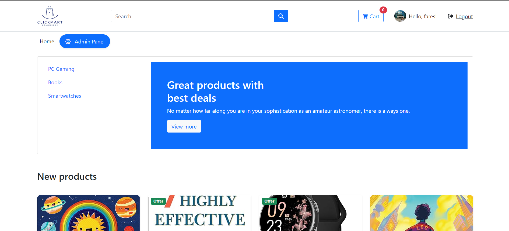
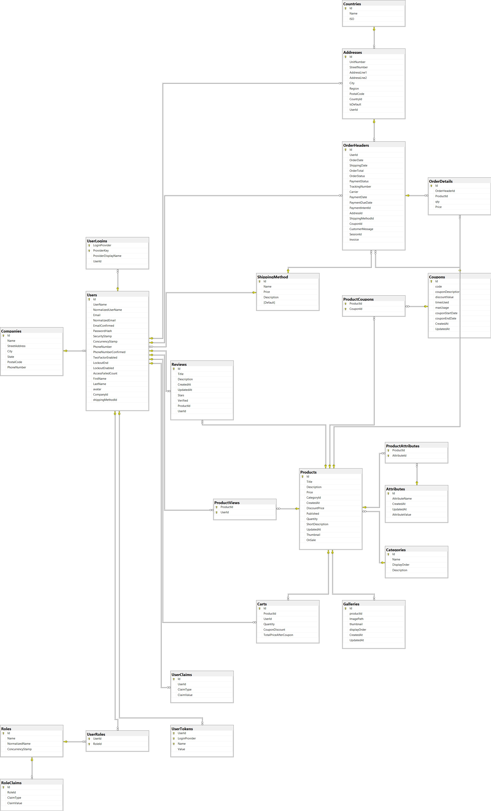

# ClickMart - E-Commerce Website with Admin Panel and Stripe Payment Integration

## Project Overview

**ClickMart** is a fully functional **e-commerce website** built using **ASP.NET MVC**. It features an admin panel for managing products, categories, users, and orders, as well as Stripe payment integration for secure transactions. Users can add products to their cart, leave reviews, and track order statuses.

## Key Features

- **Admin Panel**: Full CRUD functionality for products, categories, users, and orders.
- **Stripe Payment Integration**: Secure payment processing using Stripe.
- **Order Management**: Includes email confirmation, order tracking, and status updates.
- **Reviews**: Users can leave reviews for purchased products.
- **Responsive Design**: Fully responsive UI using Bootstrap.
- **User Authentication**: Registration, login, and password reset.

## Demo Video
[](https://drive.google.com/file/d/1FuhPFD4ptX8FeBwnR2CgIzihHtRzO7HN/view?usp=sharing)


## Live Demo

Check out the live demo of **ClickMart**:  
[ClickMart Live Demo](https://clickmart.runasp.net/)

## Database Diagram

Below is the ERD (Entity-Relationship Diagram) of the database, created using SQL Server:



## Tech Stack

- **ASP.NET Core MVC**
- **Entity Framework Core**
- **SQL Server**
- **Bootstrap 5**
- **Stripe API for Payments**
- **JavaScript & jQuery**

## Prerequisites

- **.NET 8 SDK**
- **SQL Server**
- **Stripe Account** (for API keys)

## Getting Started

### 1. Clone the Repository

```bash
git clone https://github.com/fares7elsadek/ClickMart
```

### 2. Set Up Database

- **Update the appsettings.json with your SQL Server connection string.**
- **Run the migrations to create the database.**

```bash
Update-Database
```

### 3. Configure Stripe Keys

- **Add your Stripe Secret Key and Publishable Key in the appsettings.json file:**

```json
"Stripe": {
  "SecretKey": "your-stripe-secret-key",
  "PublishableKey": "your-stripe-publishable-key"
}
```

### 4. Configure Admin Account

- **Provide default admin account credentials in the appsettings.json:**

```json
"AdminInfo": {
  "UserName": "admin",
  "FirstName": "John",
  "LastName": "Doe",
  "PhoneNumber": "1234567890",
  "Password": "Admin@123",
  "Email": "admin@example.com"
}
```

### 5. Configure SMTP Email

- **Add your SMTP email and password for sending order confirmations and other notifications.**

```json
"email": {
  "smptemail": "your-email@outlook.com",
  "smptpassword": "your-email-password"
}
```

### 6. Run the Application

- **Use the following command to run the application:**

```bash
dotnet run
```

## Contributing

- **Pull requests are welcome. For major changes, please open an issue first to discuss what you would like to change.**
